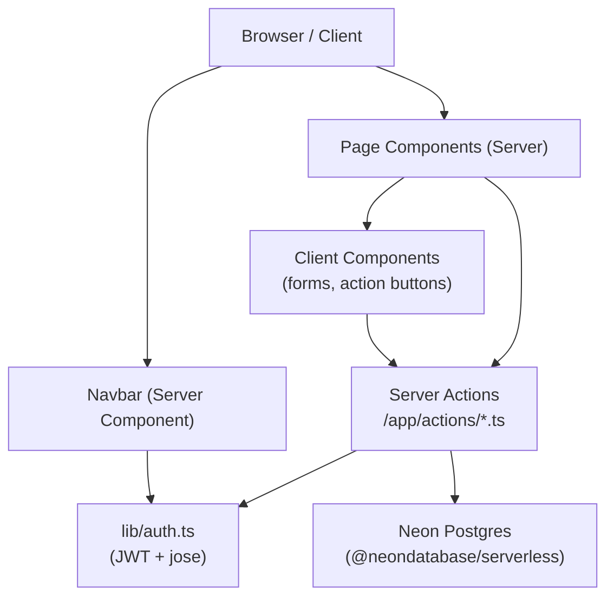
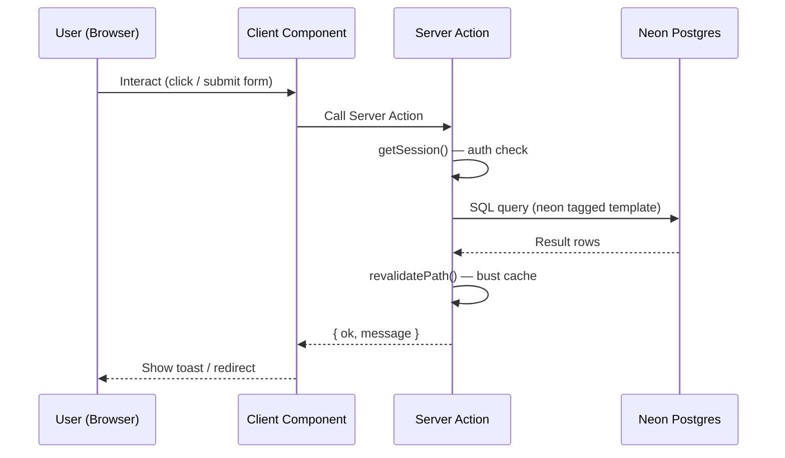
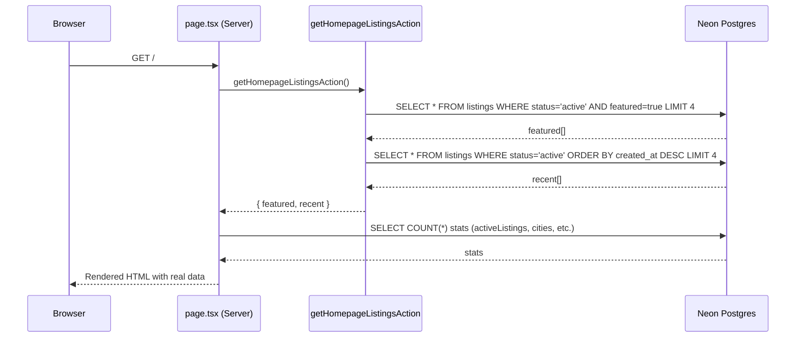
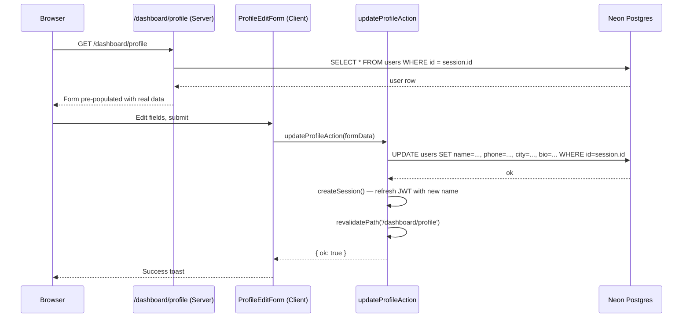
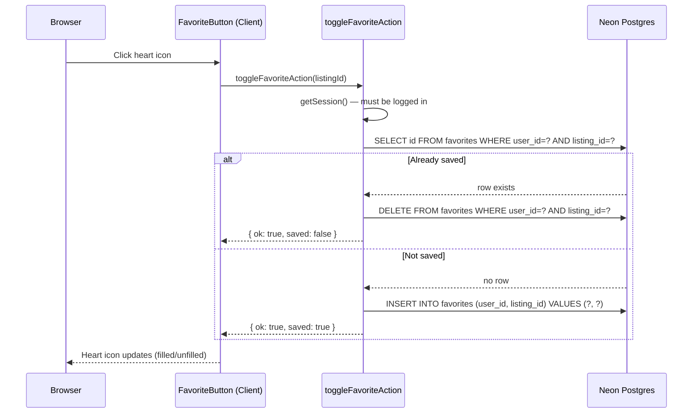
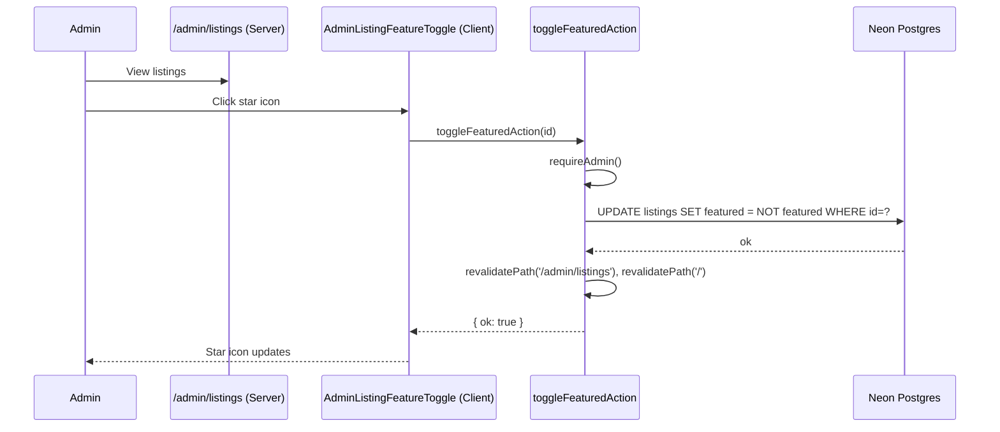

# Design Document: The City's Block — Full Platform Completion

## Overview

The City's Block is a Next.js 15 real estate portal for the Indian market (OLX-style). The core infrastructure — Neon Postgres, JWT-cookie auth, Server Actions, and the primary listing/inquiry/admin flows — is already in production. This document covers the complete design for eliminating all remaining mock data, fixing broken routes, and adding the missing features needed to make the platform fully production-ready.

The work falls into three categories: (1) **Bug fixes** — wrong URL params, broken slug routes, and pages that ignore the session; (2) **Data wiring** — replacing `@/lib/portal` mock imports with real DB queries on every remaining page; (3) **New features** — favorites, profile editing, listing editing, inquiry status management, admin feature-toggle, admin role-change, and password change.

## Architecture



### Data Flow Pattern

All data mutations follow the same pattern already established in the codebase:



## Components and Interfaces

### New Server Actions Required

#### `src/app/actions/listings.ts` — additions

```typescript
// Update own listing
updateMyListingAction(id: number, formData: ListingFormData): Promise<ActionResult>
// Preconditions: session exists, listing.user_id === session.id, listing exists
// Postconditions: listing updated, revalidatePath called for /dashboard/listings and /listings/[id]

// Get single listing for editing (owner-scoped)
getMyListingByIdAction(id: number): Promise<Listing | null>
// Preconditions: session exists
// Postconditions: returns listing only if user_id matches session.id

// Update inquiry status (owner)
updateInquiryStatusAction(id: number, status: 'new' | 'contacted' | 'closed'): Promise<ActionResult>
// Preconditions: session exists, inquiry belongs to a listing owned by session.id
// Postconditions: inquiries.status updated, revalidatePath /dashboard/leads

// Toggle favorite
toggleFavoriteAction(listingId: number): Promise<{ ok: boolean; saved: boolean }>
// Preconditions: session exists (buyer role or any role)
// Postconditions: row inserted or deleted in favorites table

// Get user's favorites
getMyFavoritesAction(): Promise<Listing[]>
// Preconditions: session exists
// Postconditions: returns listings joined with favorites for session.id

// Get featured + recent listings for homepage
getHomepageListingsAction(): Promise<{ featured: Listing[]; recent: Listing[] }>
// Postconditions: featured = status=active AND featured=true (up to 4), recent = latest 4 active
```

#### `src/app/actions/admin.ts` — additions

```typescript
// Toggle featured flag on a listing
toggleFeaturedAction(id: number): Promise<ActionResult>
// Preconditions: admin session
// Postconditions: listings.featured toggled, revalidatePath /admin/listings and /

// Change user role
changeUserRoleAction(id: number, role: 'buyer' | 'owner' | 'agent' | 'admin'): Promise<ActionResult>
// Preconditions: admin session, target user is not self
// Postconditions: users.role updated, revalidatePath /admin/users

// Get agents for /agents/[slug] page
getAgentBySlugAction(slug: string): Promise<AgentProfile | null>
// Postconditions: returns user where role='agent' and slug matches name-based slug

// Get listings by agent
getListingsByUserIdAction(userId: number): Promise<Listing[]>
// Postconditions: returns active listings for given user_id
```

#### `src/app/actions/auth.ts` — additions

```typescript
// Update own profile
updateProfileAction(formData: ProfileFormData): Promise<ActionResult>
// Preconditions: session exists
// Postconditions: users row updated (name, phone, city, bio), session cookie refreshed with new name

// Change password
changePasswordAction(currentPassword: string, newPassword: string): Promise<ActionResult>
// Preconditions: session exists, currentPassword matches stored hash
// Postconditions: users.password updated with new bcrypt hash
```

### New DB Table Required

```sql
-- favorites table (new migration needed)
CREATE TABLE IF NOT EXISTS favorites (
  id         SERIAL PRIMARY KEY,
  user_id    INTEGER NOT NULL REFERENCES users(id) ON DELETE CASCADE,
  listing_id INTEGER NOT NULL REFERENCES listings(id) ON DELETE CASCADE,
  created_at TIMESTAMPTZ DEFAULT NOW(),
  UNIQUE(user_id, listing_id)
);
```

### New Client Components Required

```typescript
// src/components/dashboard/EditListingForm.tsx
// Props: listing (full row), onSuccess callback
// Reuses same field structure as NewListingForm but pre-populated
// Calls updateMyListingAction on submit

// src/components/dashboard/ProfileEditForm.tsx
// Props: user (profile row)
// Fields: name, phone, city, bio
// Calls updateProfileAction on submit

// src/components/dashboard/PasswordChangeForm.tsx
// Fields: currentPassword, newPassword, confirmPassword
// Calls changePasswordAction on submit

// src/components/dashboard/InquiryStatusButton.tsx
// Props: id, currentStatus
// Dropdown: new → contacted → closed
// Calls updateInquiryStatusAction

// src/components/portal/FavoriteButton.tsx
// Props: listingId, initialSaved
// Heart icon toggle, calls toggleFavoriteAction
// Shows on DbListingCard and listing detail page

// src/components/admin/AdminListingFeatureToggle.tsx
// Props: id, featured (boolean)
// Star icon toggle, calls toggleFeaturedAction

// src/components/admin/AdminUserRoleSelect.tsx
// Props: id, currentRole
// Select dropdown, calls changeUserRoleAction
```

## Data Models

### Existing DB Schema (reference)

```typescript
interface User {
  id: number
  name: string
  email: string
  password: string        // bcrypt hash
  role: 'buyer' | 'owner' | 'agent' | 'admin'
  phone: string | null
  city: string | null
  bio: string | null
  avatar: string | null
  company: string | null
  verified: boolean
  banned: boolean
  created_at: Date
}

interface Listing {
  id: number
  user_id: number
  title: string
  description: string
  listing_type: 'sale' | 'rent'
  asset_class: 'residential' | 'commercial'
  property_type: string
  city: string
  locality: string | null
  address: string | null
  price: number
  price_unit: 'total' | 'month'
  area: number | null
  bhk: number | null
  bathrooms: number | null
  furnishing: string | null
  possession: string | null
  amenities: string[]
  images: string[]
  status: 'pending' | 'active' | 'rejected'
  rejection_reason: string | null
  featured: boolean
  verified: boolean
  created_at: Date
  updated_at: Date
}

interface Inquiry {
  id: number
  listing_id: number
  buyer_name: string
  buyer_email: string
  buyer_phone: string
  message: string
  status: 'new' | 'contacted' | 'closed'
  created_at: Date
}

interface Favorite {
  id: number
  user_id: number
  listing_id: number
  created_at: Date
}
```

### URL Parameter Standardization

All search/filter parameters must use snake_case to match DB column names:

| Old (broken) param | Correct param |
|---|---|
| `listingType` | `listing_type` |
| `assetClass` | `asset_class` |

Affected locations:
- `src/app/page.tsx` — hero search form (2 params)
- `src/app/commercial/page.tsx` — redirect target
- `src/components/layout/Navbar.tsx` — already correct (`asset_class=commercial`) ✓

## Sequence Diagrams

### Homepage Real Data Flow



### Profile Edit Flow



### Favorites Toggle Flow



### Admin Feature Toggle Flow



## Key Functions with Formal Specifications

### `getHomepageListingsAction()`

```typescript
async function getHomepageListingsAction(): Promise<{
  featured: Listing[]
  recent: Listing[]
  stats: { activeListings: number; cities: number }
}>
```

**Preconditions:**
- Database connection available
- No auth required (public endpoint)

**Postconditions:**
- `featured` contains up to 4 listings where `status = 'active' AND featured = true`, ordered by `created_at DESC`
- `recent` contains up to 4 listings where `status = 'active'`, ordered by `created_at DESC`
- `stats.activeListings` = COUNT of active listings
- `stats.cities` = COUNT DISTINCT of cities in active listings
- If no featured listings exist, `featured` is an empty array (homepage degrades gracefully to recent only)

### `updateMyListingAction(id, formData)`

```typescript
async function updateMyListingAction(
  id: number,
  formData: Partial<ListingFormData>
): Promise<{ ok: boolean; message: string }>
```

**Preconditions:**
- `session` exists (authenticated)
- Listing with `id` exists in DB
- `listing.user_id === session.id` (ownership check)

**Postconditions:**
- If preconditions met: listing row updated, `status` reset to `'pending'` (re-approval required after edit), `updated_at = NOW()`
- If not owner: returns `{ ok: false, message: "Not authorized" }`
- `revalidatePath('/dashboard/listings')` called
- `revalidatePath('/listings/[id]')` called

**Loop Invariants:** N/A

### `toggleFavoriteAction(listingId)`

```typescript
async function toggleFavoriteAction(
  listingId: number
): Promise<{ ok: boolean; saved: boolean; message?: string }>
```

**Preconditions:**
- `session` exists
- Listing with `listingId` exists and `status = 'active'`

**Postconditions:**
- If favorite row existed: row deleted, returns `{ ok: true, saved: false }`
- If favorite row did not exist: row inserted, returns `{ ok: true, saved: true }`
- If not authenticated: returns `{ ok: false, saved: false, message: "Sign in to save listings" }`
- DB constraint `UNIQUE(user_id, listing_id)` prevents duplicates

### `updateProfileAction(formData)`

```typescript
async function updateProfileAction(formData: {
  name: string
  phone?: string
  city?: string
  bio?: string
}): Promise<{ ok: boolean; message: string }>
```

**Preconditions:**
- `session` exists
- `formData.name` is non-empty string

**Postconditions:**
- `users` row updated for `session.id`
- JWT session cookie refreshed with updated `name` (so Navbar shows new name immediately)
- Returns `{ ok: true, message: "Profile updated" }`

### `changePasswordAction(currentPassword, newPassword)`

```typescript
async function changePasswordAction(
  currentPassword: string,
  newPassword: string
): Promise<{ ok: boolean; message: string }>
```

**Preconditions:**
- `session` exists
- `currentPassword` is non-empty
- `newPassword.length >= 6`

**Postconditions:**
- If `bcrypt.compare(currentPassword, storedHash)` is false: returns `{ ok: false, message: "Current password is incorrect" }`
- If valid: `users.password` updated with `bcrypt.hash(newPassword, 10)`, returns `{ ok: true }`

### `getAgentBySlugAction(slug)`

```typescript
async function getAgentBySlugAction(
  slug: string
): Promise<{ user: User; listings: Listing[] } | null>
```

**Preconditions:**
- `slug` is a non-empty string in format `name-id` (e.g., `"rahul-sharma-42"`)

**Postconditions:**
- Parses `id` from end of slug
- Returns user where `id = parsedId AND role = 'agent'`
- Returns their active listings
- Returns `null` if user not found or not an agent

**Slug format**: `{name-kebab-case}-{id}` — generated deterministically from `user.name` and `user.id`. This avoids needing a separate slug column.

## Algorithmic Pseudocode

### Homepage Data Assembly

```pascal
ALGORITHM getHomepageListingsAction()
INPUT: none
OUTPUT: { featured: Listing[], recent: Listing[], stats: Stats }

BEGIN
  // Parallel DB queries for performance
  PARALLEL DO
    featured ← SQL[SELECT * FROM listings WHERE status='active' AND featured=true
                   ORDER BY created_at DESC LIMIT 4]
    recent   ← SQL[SELECT * FROM listings WHERE status='active'
                   ORDER BY created_at DESC LIMIT 4]
    count    ← SQL[SELECT COUNT(*) FROM listings WHERE status='active']
    cities   ← SQL[SELECT COUNT(DISTINCT city) FROM listings WHERE status='active']
  END PARALLEL

  RETURN { featured, recent, stats: { activeListings: count, cities } }
END
```

### Agent Slug Resolution

```pascal
ALGORITHM getAgentBySlugAction(slug)
INPUT: slug: String (format: "name-parts-{id}")
OUTPUT: AgentData | null

BEGIN
  parts ← slug.split("-")
  id    ← parseInt(parts[parts.length - 1])

  IF id IS NaN THEN
    RETURN null
  END IF

  user ← SQL[SELECT * FROM users WHERE id = id AND role = 'agent' LIMIT 1]

  IF user IS NULL THEN
    RETURN null
  END IF

  listings ← SQL[SELECT * FROM listings WHERE user_id = id AND status = 'active'
                 ORDER BY created_at DESC]

  RETURN { user, listings }
END
```

### Favorites Toggle

```pascal
ALGORITHM toggleFavoriteAction(listingId)
INPUT: listingId: Integer
OUTPUT: { ok: Boolean, saved: Boolean }

BEGIN
  session ← getSession()
  IF session IS NULL THEN
    RETURN { ok: false, saved: false, message: "Sign in to save listings" }
  END IF

  existing ← SQL[SELECT id FROM favorites
                 WHERE user_id = session.id AND listing_id = listingId]

  IF existing.length > 0 THEN
    SQL[DELETE FROM favorites WHERE user_id = session.id AND listing_id = listingId]
    RETURN { ok: true, saved: false }
  ELSE
    SQL[INSERT INTO favorites (user_id, listing_id) VALUES (session.id, listingId)
        ON CONFLICT DO NOTHING]
    RETURN { ok: true, saved: true }
  END IF
END
```

## Page-by-Page Fix Plan

### Pages with URL Parameter Bugs

| Page | Bug | Fix |
|---|---|---|
| `src/app/page.tsx` | Hero form uses `listingType`, `assetClass` | Change to `listing_type`, `asset_class` |
| `src/app/commercial/page.tsx` | Redirects to `?assetClass=commercial` | Change to `?asset_class=commercial` |

### Pages Requiring Mock → DB Wiring

| Page | Current State | Required Change |
|---|---|---|
| `src/app/page.tsx` | `getFeaturedListings()` from portal lib | Call `getHomepageListingsAction()`, use `DbListingCard` |
| `src/app/dashboard/profile/page.tsx` | `profiles[0]` hardcoded | `getSession()` + `SELECT * FROM users WHERE id=session.id` |
| `src/app/account/page.tsx` | Mock `savedSearches`, `inquiries`, `listings` | Session-aware: show real inquiry count, favorites count |
| `src/app/favorites/page.tsx` | `listings.slice(0,4)` mock | `getMyFavoritesAction()` — real saved listings |
| `src/app/commercial/page.tsx` | Redirect only | Full page with `getPublicListingsAction({ asset_class: 'commercial' })` |
| `src/app/agents/[slug]/page.tsx` | `getProfile(slug)` from portal lib | `getAgentBySlugAction(slug)` from DB |
| `src/app/property/[slug]/page.tsx` | `getListing(slug)` from portal lib | Redirect to `/listings/[id]` or resolve slug to id |
| `src/app/dashboard/saved-searches/page.tsx` | Mock `savedSearches` | Remove or show empty state (feature deferred) |
| `src/app/admin/localities/page.tsx` | Mock `localities` | Show real city stats from DB |
| `src/app/admin/projects/page.tsx` | Mock `projects` | Show informational placeholder (no projects table) |

### New Feature Pages

| Feature | Route | New Components |
|---|---|---|
| Edit listing | `/dashboard/listings/[id]/edit` | `EditListingForm` client component |
| Favorites | `/favorites` | `FavoriteButton`, `getMyFavoritesAction` |
| Profile edit | `/dashboard/profile` | `ProfileEditForm`, `PasswordChangeForm` |
| Inquiry status | `/dashboard/leads` | `InquiryStatusButton` |
| Admin feature toggle | `/admin/listings` | `AdminListingFeatureToggle` |
| Admin role change | `/admin/users` | `AdminUserRoleSelect` |

## Error Handling

### Authentication Errors

**Condition**: Session missing or expired on protected page  
**Response**: `redirect('/login')` — already implemented on all dashboard/admin pages  
**Recovery**: User logs in, returns to intended page

### Authorization Errors (Ownership Check)

**Condition**: User attempts to edit/delete a listing they don't own  
**Response**: Server action returns `{ ok: false, message: "Not authorized" }` — never throws  
**Recovery**: Client shows error toast, no state change

### Favorites on Unauthenticated Request

**Condition**: `toggleFavoriteAction` called without session  
**Response**: `{ ok: false, message: "Sign in to save listings" }`  
**Recovery**: Client shows "Sign in" prompt or redirects to `/login`

### Slug Not Found (Agent / Property Pages)

**Condition**: `getAgentBySlugAction` returns null  
**Response**: `notFound()` — renders Next.js 404 page  
**Recovery**: User navigates back

### DB Constraint Violation (Duplicate Favorite)

**Condition**: Race condition causes double-insert to favorites  
**Response**: `ON CONFLICT DO NOTHING` in SQL — silent deduplication  
**Recovery**: Transparent to user

### Edit Listing Re-approval

**Condition**: Owner edits an active listing  
**Response**: Status reset to `'pending'` — listing goes offline until re-approved  
**Recovery**: Admin receives pending notification, re-approves

## Testing Strategy

### Unit Testing Approach

Test each Server Action in isolation by mocking `sql` and `getSession`:

- `getHomepageListingsAction` — verify parallel queries, correct LIMIT values
- `toggleFavoriteAction` — test insert path, delete path, unauthenticated path
- `updateMyListingAction` — test ownership check, status reset to pending
- `changePasswordAction` — test wrong password rejection, hash update
- `getAgentBySlugAction` — test slug parsing, non-agent rejection, not-found case

### Property-Based Testing Approach

**Property Test Library**: fast-check

Key properties to verify:

1. **Slug round-trip**: For any user with `role='agent'`, `generateSlug(user)` followed by `parseIdFromSlug(slug)` always returns `user.id`
2. **Favorite idempotency**: Calling `toggleFavoriteAction` twice on the same listing always returns the original state (toggle is its own inverse)
3. **Price formatting**: For any positive integer price, `formatPrice(price)` returns a non-empty string starting with `₹`
4. **Auth guard**: Any Server Action that calls `requireAdmin()` with a non-admin session always returns an error, never mutates DB

### Integration Testing Approach

End-to-end flows to verify manually or with Playwright:

1. **Homepage → Search**: Click "Buy" in hero form → lands on `/search?listing_type=sale` (not `listingType`)
2. **Listing detail → Favorite**: Click heart on `/listings/[id]` → heart fills, `/favorites` shows the listing
3. **Owner edit listing**: `/dashboard/listings/[id]/edit` → submit → listing shows as `pending` in dashboard
4. **Admin feature toggle**: Star a listing in `/admin/listings` → listing appears in homepage featured section
5. **Profile edit**: Update name in `/dashboard/profile` → Navbar immediately shows new name

## Performance Considerations

- **Homepage parallel queries**: Use `Promise.all` for featured, recent, and stats queries — reduces homepage load from ~3 sequential round-trips to 1 parallel batch
- **`revalidatePath` scope**: Keep revalidation targeted (specific paths, not `'/'` globally) to avoid over-invalidating the Next.js cache
- **Favorites query**: Join `favorites` with `listings` in a single query rather than two separate queries
- **Agent slug**: Parse ID from slug end to use indexed `WHERE id = ?` lookup — avoids full-table scan
- **`DbListingCard` images**: Already uses `next/image` with `fill` — no changes needed

## Security Considerations

- **Ownership enforcement**: All owner-scoped mutations (`updateMyListingAction`, `deleteMyListingAction`, `updateInquiryStatusAction`) include `AND user_id = session.id` in the SQL WHERE clause — DB-level enforcement, not just application-level
- **Admin guard**: `requireAdmin()` helper throws before any DB mutation — already in place, extended to new admin actions
- **Password change**: Requires current password verification before updating — prevents account takeover if session is stolen
- **Favorites auth**: `toggleFavoriteAction` checks session before any DB operation — unauthenticated users cannot pollute the favorites table
- **SQL injection**: All queries use Neon's tagged template literals (`sql\`...\``) — parameterized by design, no string concatenation
- **Role escalation**: `changeUserRoleAction` prevents admin from changing their own role (self-demotion guard)

## Dependencies

All required dependencies are already installed:

| Package | Purpose | Already in package.json |
|---|---|---|
| `@neondatabase/serverless` | Postgres client | ✓ |
| `jose` | JWT sign/verify | ✓ |
| `bcryptjs` | Password hashing | ✓ |
| `next` (v15) | Framework, Server Actions, revalidatePath | ✓ |
| `tailwindcss` | Styling | ✓ |
| `shadcn/ui` | UI components (Button, Input, Select, Badge, etc.) | ✓ |

No new npm packages are required. The `favorites` table requires one new DB migration (CREATE TABLE statement) which can be run directly against Neon.
