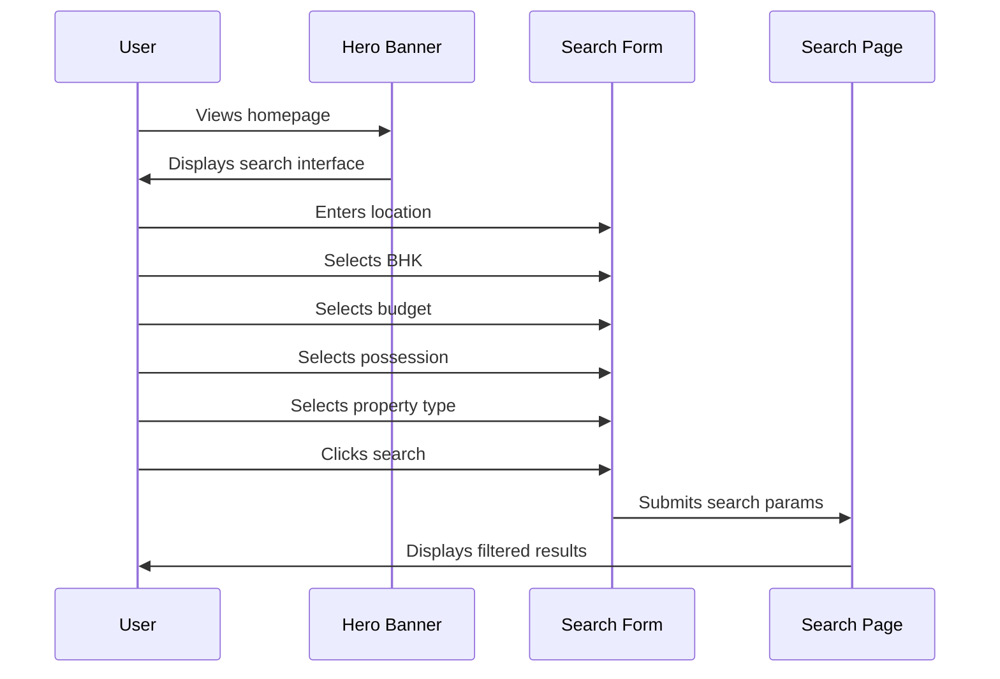
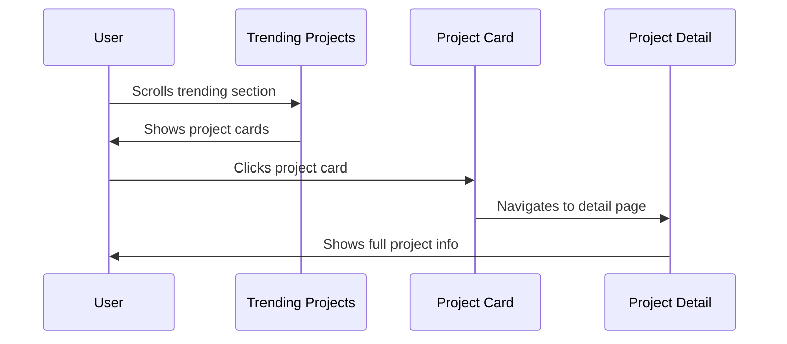
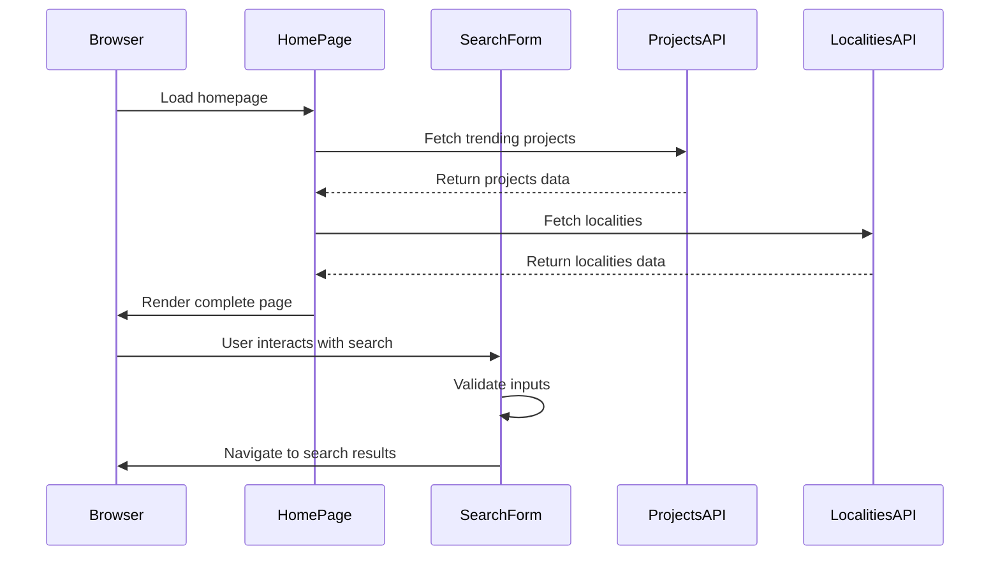

# Design Document: VitalSpace Exact Clone Homepage

## Overview

This design document outlines the complete transformation of the current homepage into an exact replica of VitalSpace.in's homepage. The redesign focuses on creating a comprehensive property search portal with a clean, professional interface optimized for property discovery in Ahmedabad and other Indian cities.

The homepage will feature a multi-section layout including: navigation with secondary tabs, hero banner with advanced search, property discovery cards, trending projects carousel, promotional banners, locality-based project exploration, extensive SEO-optimized property links, FAQ accordion, and a detailed footer. The design emphasizes mobile-first responsive layouts, high-quality imagery, and conversion-focused CTAs.

## Architecture

```mermaid
graph TD
    A[Homepage Layout] --> B[Top Navigation Bar]
    A --> C[Hero Banner Section]
    A --> D[Find Your Next Home Section]
    A --> E[Trending Projects Section]
    A --> F[Promotional Banner]
    A --> G[Explore by Localities Section]
    A --> H[Property Options Section]
    A --> I[FAQ Section]
    A --> J[Footer]
    
    B --> B1[Primary Nav]
    B --> B2[Secondary Tabs]
    
    C --> C1[Search Bar Component]
    C --> C2[Popular Localities Links]
    
    D --> D1[New Projects Card]
    D --> D2[Owner Listings Card]
    
    E --> E1[Project Cards Grid]
    E --> E2[Horizontal Scroll]
    
    G --> G1[Tabbed Interface]
    G --> G2[Locality Project Links]
    
    H --> H1[Multiple Link Sections]
    H --> H2[Expandable Lists]
    
    I --> I1[Accordion Component]
    
    J --> J1[Company Info]
    J --> J2[Navigation Links]
    J --> J3[Contact Info]
    J --> J4[Social Media]
```



## Sequence Diagrams

### User Search Flow



### Project Discovery Flow



## Components and Interfaces

### Component 1: TopNavigationBar

**Purpose**: Primary navigation with logo, main menu items, and secondary tabs

**Interface**:
```typescript
interface TopNavigationBarProps {
  logo: {
    src: string;
    alt: string;
  };
  primaryNav: NavItem[];
  secondaryTabs: string[];
}

interface NavItem {
  label: string;
  href: string;
  icon?: React.ReactNode;
}
```

**Responsibilities**:
- Display brand logo and identity
- Provide primary navigation (Buy, Sell, Explore, New Projects)
- Show secondary tabs (Top Builder, Popular Projects, Top Localities)
- Maintain sticky positioning on scroll
- Handle mobile responsive menu

### Component 2: HeroBanner

**Purpose**: Main hero section with headline and comprehensive search interface

**Interface**:
```typescript
interface HeroBannerProps {
  backgroundImage: string;
  headline: string;
  searchConfig: SearchConfig;
  popularLocalities: LocalityLink[];
}

interface SearchConfig {
  locationOptions: string[];
  bhkOptions: string[];
  budgetRanges: BudgetRange[];
  possessionOptions: string[];
  propertyTypes: string[];
}

interface LocalityLink {
  name: string;
  slug: string;
  href: string;
}

interface BudgetRange {
  label: string;
  min: number;
  max: number;
}
```

**Responsibilities**:
- Display large banner with background image
- Show prominent headline
- Render multi-filter search form
- Display popular localities as clickable links
- Handle search form submission
- Optimize for mobile devices

### Component 3: FindYourHomeSection

**Purpose**: Two-card layout for new projects and owner listings

**Interface**:
```typescript
interface FindYourHomeSectionProps {
  cards: HomeCard[];
}

interface HomeCard {
  id: string;
  icon: React.ReactNode;
  title: string;
  description: string;
  ctaText: string;
  ctaHref: string;
}
```

**Responsibilities**:
- Display two large cards side by side
- Show icons, titles, and descriptions
- Provide "Explore" buttons
- Handle responsive grid layout

### Component 4: TrendingProjectsSection

**Purpose**: Horizontal scrollable grid of trending project cards

**Interface**:
```typescript
interface TrendingProjectsSectionProps {
  title: string;
  seeAllHref: string;
  projects: ProjectCardData[];
}

interface ProjectCardData {
  id: string;
  name: string;
  builder: string;
  image: string;
  configurations: string[];
  location: string;
  priceRange: {
    min: number;
    max: number;
  };
  slug: string;
}
```

**Responsibilities**:
- Display section header with "See All" link
- Render horizontal scrollable project cards
- Show project images, names, builders, BHK configs
- Display location and price range
- Handle card click navigation

### Component 5: ProjectCard

**Purpose**: Individual project card with image and details

**Interface**:
```typescript
interface ProjectCardProps {
  project: ProjectCardData;
  variant?: 'default' | 'compact';
}
```

**Responsibilities**:
- Display project image
- Show project name and builder
- Display BHK configurations
- Show location with icon
- Display price range
- Handle hover effects
- Navigate to project detail page

### Component 6: PromotionalBanner

**Purpose**: Full-width clickable promotional image banner

**Interface**:
```typescript
interface PromotionalBannerProps {
  image: string;
  alt: string;
  href: string;
  priority?: boolean;
}
```

**Responsibilities**:
- Display full-width banner image
- Handle click navigation
- Optimize image loading
- Maintain aspect ratio

### Component 7: ExploreByLocalitiesSection

**Purpose**: Tabbed interface showing projects grouped by locality

**Interface**:
```typescript
interface ExploreByLocalitiesSectionProps {
  title: string;
  localities: LocalityTab[];
}

interface LocalityTab {
  name: string;
  slug: string;
  projects: LocalityProject[];
}

interface LocalityProject {
  name: string;
  slug: string;
  href: string;
}
```

**Responsibilities**:
- Display tabbed interface
- Show locality tabs (Ambli, Science City, Shela, etc.)
- Render project links grid for active tab
- Handle tab switching
- Maintain clean, organized layout

### Component 8: PropertyOptionsSection

**Purpose**: Multiple subsections with extensive property search links

**Interface**:
```typescript
interface PropertyOptionsSectionProps {
  title: string;
  subsections: PropertySubsection[];
}

interface PropertySubsection {
  id: string;
  title: string;
  links: PropertyLink[];
  expandable?: boolean;
  initialVisibleCount?: number;
}

interface PropertyLink {
  label: string;
  href: string;
}
```

**Responsibilities**:
- Display multiple subsections (Popular BHK, Budget-wise, etc.)
- Render clickable property search links
- Handle "+X more" expandable functionality
- Organize links in grid layout
- Optimize for SEO

### Component 9: FAQSection

**Purpose**: Accordion-style frequently asked questions

**Interface**:
```typescript
interface FAQSectionProps {
  title: string;
  faqs: FAQItem[];
}

interface FAQItem {
  id: string;
  question: string;
  answer: string;
}
```

**Responsibilities**:
- Display FAQ accordion
- Handle expand/collapse interactions
- Show questions and answers
- Maintain accessible markup

### Component 10: SiteFooter

**Purpose**: Comprehensive footer with company info, links, and contact details

**Interface**:
```typescript
interface SiteFooterProps {
  logo: {
    src: string;
    alt: string;
  };
  description: string;
  reraNumber: string;
  navigationLinks: FooterLink[];
  contactInfo: ContactInfo;
  socialMedia: SocialLink[];
  copyright: string;
}

interface FooterLink {
  label: string;
  href: string;
}

interface ContactInfo {
  phone: string;
  email: string;
}

interface SocialLink {
  platform: string;
  href: string;
  icon: React.ReactNode;
}
```

**Responsibilities**:
- Display VitalSpace logo and description
- Show RERA registration number
- Render navigation links
- Display contact information
- Show social media icons
- Display copyright notice

## Data Models

### Model 1: SearchFormData

```typescript
interface SearchFormData {
  location: string;
  bhk: string[];
  budgetMin: number;
  budgetMax: number;
  possession: string;
  propertyType: string;
}
```

**Validation Rules**:
- location must be non-empty string
- bhk can be empty array or contain valid BHK values
- budgetMin must be >= 0
- budgetMax must be > budgetMin
- possession must be valid option or empty
- propertyType must be valid option or empty

### Model 2: Project

```typescript
interface Project {
  id: string;
  name: string;
  slug: string;
  builder: string;
  image: string;
  configurations: string[];
  location: {
    locality: string;
    city: string;
  };
  priceRange: {
    min: number;
    max: number;
    currency: string;
  };
  featured?: boolean;
}
```

**Validation Rules**:
- id must be unique
- name must be non-empty
- slug must be URL-safe
- configurations must contain at least one BHK type
- priceRange.min must be > 0
- priceRange.max must be >= priceRange.min

### Model 3: Locality

```typescript
interface Locality {
  id: string;
  name: string;
  slug: string;
  city: string;
  projects: string[];
}
```

**Validation Rules**:
- id must be unique
- name must be non-empty
- slug must be URL-safe
- city must be valid city name
- projects array can be empty

## Main Algorithm/Workflow



## Key Functions with Formal Specifications

### Function 1: getHomepageData()

```typescript
async function getHomepageData(): Promise<HomepageData>
```

**Preconditions:**
- Database connection is available
- API endpoints are accessible

**Postconditions:**
- Returns valid HomepageData object
- All required data fields are populated
- Data is fresh (cached appropriately)

**Loop Invariants:** N/A

### Function 2: validateSearchForm()

```typescript
function validateSearchForm(data: SearchFormData): ValidationResult
```

**Preconditions:**
- data object is defined and has required fields

**Postconditions:**
- Returns ValidationResult with isValid boolean
- If invalid, errors array contains descriptive messages
- No mutations to input data

**Loop Invariants:** N/A

### Function 3: handleSearchSubmit()

```typescript
async function handleSearchSubmit(
  formData: SearchFormData
): Promise<void>
```

**Preconditions:**
- formData is validated
- Router is available for navigation

**Postconditions:**
- Navigates to search results page with query params
- Query params correctly encode all search filters
- No side effects on form state

**Loop Invariants:** N/A

## Algorithmic Pseudocode

### Main Homepage Rendering Algorithm

```pascal
ALGORITHM renderHomepage()
INPUT: None
OUTPUT: Rendered homepage component

BEGIN
  // Step 1: Fetch data
  homepageData ← AWAIT getHomepageData()
  
  ASSERT homepageData IS NOT NULL
  ASSERT homepageData.projects.length > 0
  
  // Step 2: Render sections in order
  sections ← []
  
  sections.add(renderTopNavigation())
  sections.add(renderHeroBanner(homepageData.searchConfig))
  sections.add(renderFindYourHome())
  sections.add(renderTrendingProjects(homepageData.projects))
  sections.add(renderPromotionalBanner())
  sections.add(renderExploreByLocalities(homepageData.localities))
  sections.add(renderPropertyOptions(homepageData.propertyLinks))
  sections.add(renderFAQ(homepageData.faqs))
  sections.add(renderFooter())
  
  // Step 3: Compose and return
  RETURN composeLayout(sections)
END
```

**Preconditions:**
- Next.js app is properly configured
- All required data sources are available

**Postconditions:**
- Complete homepage is rendered
- All sections are in correct order
- Page is SEO-optimized

**Loop Invariants:**
- All added sections are valid React components

### Search Form Validation Algorithm

```pascal
ALGORITHM validateSearchForm(formData)
INPUT: formData of type SearchFormData
OUTPUT: validationResult of type ValidationResult

BEGIN
  errors ← []
  
  // Validate location
  IF formData.location IS EMPTY THEN
    errors.add("Location is required")
  END IF
  
  // Validate budget range
  IF formData.budgetMin < 0 THEN
    errors.add("Minimum budget must be non-negative")
  END IF
  
  IF formData.budgetMax <= formData.budgetMin THEN
    errors.add("Maximum budget must be greater than minimum")
  END IF
  
  // Validate BHK selection
  IF formData.bhk.length > 0 THEN
    FOR each bhkValue IN formData.bhk DO
      IF NOT isValidBHK(bhkValue) THEN
        errors.add("Invalid BHK value: " + bhkValue)
      END IF
    END FOR
  END IF
  
  // Return result
  IF errors.length = 0 THEN
    RETURN {isValid: true, errors: []}
  ELSE
    RETURN {isValid: false, errors: errors}
  END IF
END
```

**Preconditions:**
- formData parameter is provided
- formData has all required fields

**Postconditions:**
- Returns ValidationResult object
- isValid is true if and only if no errors found
- errors array contains all validation messages

**Loop Invariants:**
- All checked BHK values are processed
- errors array contains only valid error messages

## Example Usage

### Example 1: Basic Homepage Component

```typescript
// app/page.tsx
import { HeroBanner } from '@/components/HeroBanner';
import { TrendingProjects } from '@/components/TrendingProjects';
import { getHomepageData } from '@/lib/data';

export default async function HomePage() {
  const data = await getHomepageData();
  
  return (
    <main>
      <HeroBanner 
        backgroundImage="/images/hero-banner.webp"
        headline="Explore 1000+ Verified Properties"
        searchConfig={data.searchConfig}
        popularLocalities={data.popularLocalities}
      />
      
      <TrendingProjects 
        title="Trending Projects in Ahmedabad"
        projects={data.trendingProjects}
        seeAllHref="/ahmedabad"
      />
      
      {/* Additional sections */}
    </main>
  );
}
```

### Example 2: Search Form Component

```typescript
'use client';

import { useState } from 'react';
import { useRouter } from 'next/navigation';

export function SearchForm({ config }: { config: SearchConfig }) {
  const router = useRouter();
  const [formData, setFormData] = useState<SearchFormData>({
    location: '',
    bhk: [],
    budgetMin: 0,
    budgetMax: 10000000,
    possession: '',
    propertyType: ''
  });
  
  const handleSubmit = (e: React.FormEvent) => {
    e.preventDefault();
    
    const validation = validateSearchForm(formData);
    if (!validation.isValid) {
      // Show errors
      return;
    }
    
    // Build query string
    const params = new URLSearchParams();
    if (formData.location) params.set('location', formData.location);
    if (formData.bhk.length) params.set('bhk', formData.bhk.join(','));
    params.set('budgetMin', formData.budgetMin.toString());
    params.set('budgetMax', formData.budgetMax.toString());
    if (formData.possession) params.set('possession', formData.possession);
    if (formData.propertyType) params.set('propertyType', formData.propertyType);
    
    router.push(`/search?${params.toString()}`);
  };
  
  return (
    <form onSubmit={handleSubmit} className="search-form">
      {/* Form fields */}
    </form>
  );
}
```

### Example 3: Project Card Component

```typescript
import Image from 'next/image';
import Link from 'next/link';

export function ProjectCard({ project }: { project: ProjectCardData }) {
  return (
    <Link href={`/project/${project.slug}`}>
      <div className="project-card">
        <div className="relative aspect-[4/3]">
          <Image 
            src={project.image}
            alt={project.name}
            fill
            className="object-cover"
          />
        </div>
        
        <div className="p-4">
          <h3 className="text-lg font-semibold">{project.name}</h3>
          <p className="text-sm text-gray-600">{project.builder}</p>
          
          <div className="mt-2">
            <span className="text-sm">{project.configurations.join(', ')}</span>
          </div>
          
          <div className="mt-2 flex items-center gap-2">
            <MapPinIcon className="h-4 w-4" />
            <span className="text-sm">{project.location}</span>
          </div>
          
          <div className="mt-2 font-medium">
            ₹{formatPrice(project.priceRange.min)} - ₹{formatPrice(project.priceRange.max)}
          </div>
        </div>
      </div>
    </Link>
  );
}
```

## Correctness Properties

### Property 1: Search Form Validation

**Universal Quantification:**
```
∀ formData ∈ SearchFormData:
  validateSearchForm(formData).isValid = true ⟹
    formData.location ≠ "" ∧
    formData.budgetMin ≥ 0 ∧
    formData.budgetMax > formData.budgetMin ∧
    ∀ bhk ∈ formData.bhk: isValidBHK(bhk) = true
```

**Property Description:**
For all search form data, if validation passes, then location is non-empty, budget range is valid, and all BHK values are valid.

### Property 2: Homepage Data Completeness

**Universal Quantification:**
```
∀ data ∈ HomepageData:
  isValidHomepageData(data) = true ⟹
    data.projects.length > 0 ∧
    data.localities.length > 0 ∧
    data.searchConfig ≠ null ∧
    data.faqs.length > 0
```

**Property Description:**
For all homepage data, if it's valid, then it contains at least one project, one locality, a search config, and at least one FAQ.

### Property 3: Project Card Navigation

**Universal Quantification:**
```
∀ project ∈ Project:
  project.slug ≠ "" ⟹
    navigateToProject(project) = `/project/${project.slug}`
```

**Property Description:**
For all projects with non-empty slugs, navigation generates the correct URL path.

### Property 4: Responsive Layout Integrity

**Universal Quantification:**
```
∀ viewport ∈ ViewportSize:
  renderHomepage(viewport) ⟹
    allSectionsVisible(viewport) ∧
    noHorizontalOverflow(viewport) ∧
    touchTargetsAccessible(viewport)
```

**Property Description:**
For all viewport sizes, the homepage renders with all sections visible, no horizontal overflow, and accessible touch targets.

## Error Handling

### Error Scenario 1: Data Fetch Failure

**Condition**: API call to fetch homepage data fails
**Response**: 
- Log error to monitoring service
- Display fallback UI with cached data if available
- Show user-friendly error message if no cache
**Recovery**: 
- Implement retry logic with exponential backoff
- Fall back to static content
- Allow user to manually refresh

### Error Scenario 2: Invalid Search Parameters

**Condition**: User submits search form with invalid data
**Response**:
- Prevent form submission
- Display inline validation errors
- Highlight invalid fields
**Recovery**:
- User corrects invalid fields
- Form revalidates on change
- Submit enabled when all fields valid

### Error Scenario 3: Image Load Failure

**Condition**: Project or banner image fails to load
**Response**:
- Display placeholder image
- Log error for monitoring
- Show alt text
**Recovery**:
- Retry image load after delay
- Use fallback CDN if available
- Maintain layout integrity

### Error Scenario 4: Navigation Failure

**Condition**: Click on project card or link fails to navigate
**Response**:
- Log navigation error
- Show toast notification
- Provide alternative navigation method
**Recovery**:
- Retry navigation
- Offer direct URL copy
- Suggest browser refresh

## Testing Strategy

### Unit Testing Approach

**Components to Test:**
- SearchForm validation logic
- ProjectCard rendering
- LocalityTab switching
- FAQ accordion expand/collapse
- Footer link rendering

**Key Test Cases:**
1. SearchForm validates all field combinations correctly
2. ProjectCard displays all required information
3. LocalityTab switches between tabs without errors
4. FAQ accordion maintains state correctly
5. Footer renders all links and contact info

**Coverage Goals:**
- 90%+ code coverage for utility functions
- 80%+ coverage for component logic
- 100% coverage for validation functions

### Property-Based Testing Approach

**Property Test Library**: fast-check (for TypeScript/JavaScript)

**Properties to Test:**

1. **Search Form Validation Idempotency**
   - Property: Validating the same form data twice produces identical results
   - Generator: Generate random SearchFormData objects
   - Assertion: `validateSearchForm(data) === validateSearchForm(data)`

2. **Project Card Rendering Consistency**
   - Property: All project cards with valid data render without errors
   - Generator: Generate random valid Project objects
   - Assertion: `render(<ProjectCard project={p} />)` succeeds for all p

3. **URL Generation Correctness**
   - Property: Generated URLs are always valid and navigable
   - Generator: Generate random search parameters
   - Assertion: Generated URL matches expected pattern and is parseable

4. **Responsive Layout Stability**
   - Property: Layout remains stable across viewport size changes
   - Generator: Generate random viewport dimensions
   - Assertion: No layout shift or overflow occurs

### Integration Testing Approach

**Integration Points:**
1. Homepage data fetching and rendering
2. Search form submission and navigation
3. Project card click and detail page load
4. Locality tab switching and project list update
5. FAQ accordion interaction

**Test Scenarios:**
- User loads homepage → sees all sections
- User submits search → navigates to results
- User clicks project → sees project details
- User switches locality tab → sees different projects
- User expands FAQ → sees answer

## Performance Considerations

**Image Optimization:**
- Use Next.js Image component for automatic optimization
- Implement lazy loading for below-fold images
- Use WebP format with fallbacks
- Serve responsive images based on viewport

**Code Splitting:**
- Split components by route
- Lazy load FAQ and PropertyOptions sections
- Dynamic import for heavy components

**Caching Strategy:**
- Cache homepage data with 5-minute TTL
- Use SWR for client-side data fetching
- Implement service worker for offline support
- Cache static assets aggressively

**Performance Targets:**
- First Contentful Paint (FCP): < 1.5s
- Largest Contentful Paint (LCP): < 2.5s
- Time to Interactive (TTI): < 3.5s
- Cumulative Layout Shift (CLS): < 0.1

**Optimization Techniques:**
- Server-side rendering for initial load
- Prefetch critical resources
- Minimize JavaScript bundle size
- Use CSS-in-JS with critical CSS extraction

## Security Considerations

**Input Validation:**
- Sanitize all search form inputs
- Validate URL parameters server-side
- Prevent XSS through proper escaping
- Use Content Security Policy headers

**Data Protection:**
- No sensitive data in client-side code
- Secure API endpoints with authentication
- Rate limit search requests
- Implement CSRF protection

**Third-Party Resources:**
- Verify integrity of external scripts
- Use Subresource Integrity (SRI)
- Audit dependencies regularly
- Minimize third-party tracking

**Access Control:**
- Public pages require no authentication
- Admin features properly protected
- Role-based access for data management
- Secure session handling

## Dependencies

**Core Framework:**
- Next.js 14+ (App Router)
- React 18+
- TypeScript 5+

**Styling:**
- Tailwind CSS 3+
- shadcn/ui components
- Lucide React icons

**Data Fetching:**
- SWR or React Query
- Axios or native fetch

**Image Handling:**
- Next.js Image component
- Sharp for image processing

**Form Management:**
- React Hook Form
- Zod for validation

**UI Components:**
- Radix UI primitives
- Framer Motion for animations

**Development Tools:**
- ESLint
- Prettier
- TypeScript compiler

**Testing:**
- Jest
- React Testing Library
- fast-check for property-based testing
- Playwright for E2E testing

**Deployment:**
- Vercel or similar platform
- CDN for static assets
- Database (PostgreSQL/MongoDB)
- Redis for caching
